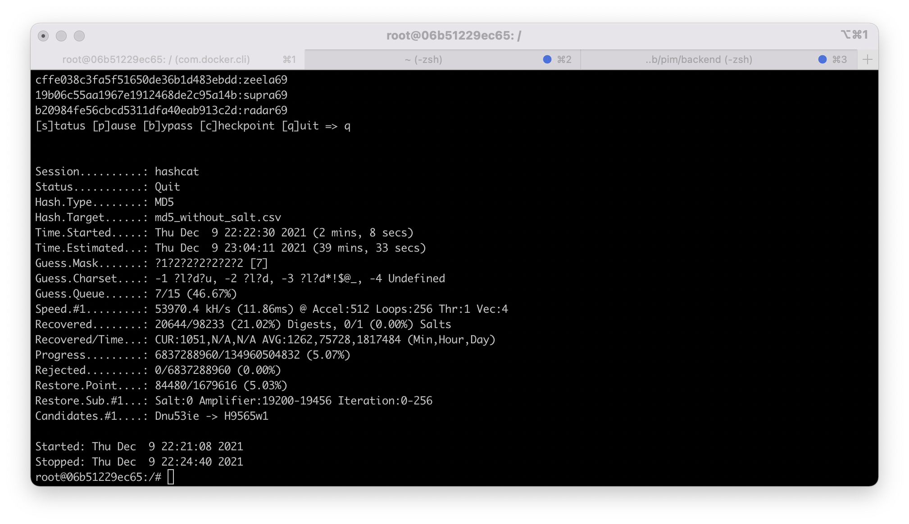

## lab 4 report

### MD5 crack

####Dictionary

####Brute force

### Bcrypt crack

####Dictionary

So if you want to secure your password you shouldn’t use just primitive md5 or sha2 hash functions
You should combine them with encryptions algorithms like argon2 or bcrypt or just don’t use them for storing password
As a user you should verify that your password don’t exist in common passwords db
Because it makes it easier for hackers to crack your password